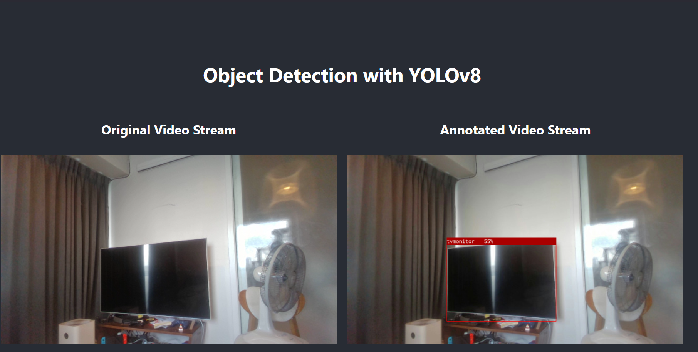
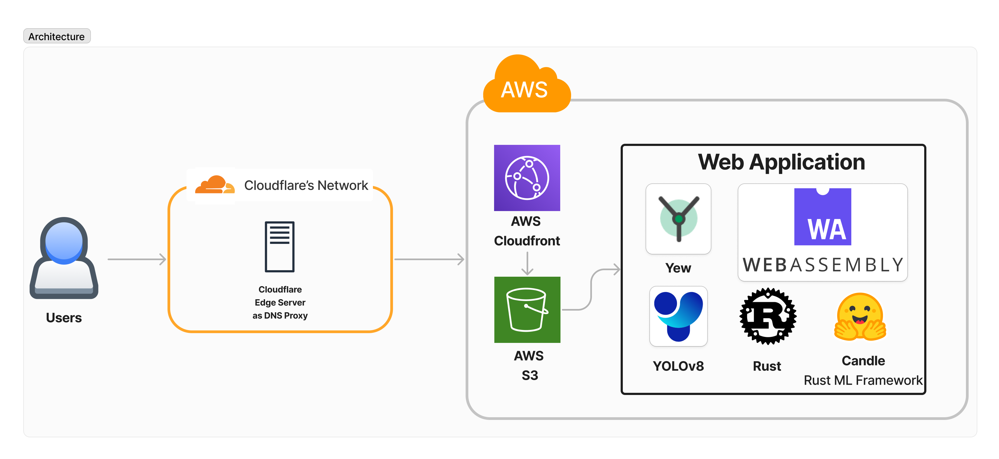

# 🚀 Overview

>🔥 Simple Web application for YOLOv8 Object Detection using **Pure Rust! which are Yew & WebAssembly**!  
> 🧑‍💻 This repository is a clone of my another project based on *React + Rust's Webassembly: [yolo-wasm](github.com/korntewin/yolo-wasm)*.

The web application is run & rendered purely on client-side 🖥️ without transferring any data out to the public internet, so no need to worry!

The YOLOv8 model is backed by Rust programming language compiled into WebAssembly 🎉 which is imported and modified from 🕯️[candle](https://github.com/huggingface/candle) repository. Below is the example of webapp:

And the UI is rendered using [Yew](yew.rs/), UI framework similar to *React* but on pure Rust!

> In my opinion, the concept of *[web worker](https://developer.mozilla.org/en-US/docs/Web/API/Web_Workers_API)* is by far easier to be integrated with *Web Assembly* using *Yew* than using *React*!

*Note that, the web app has the most performance on firefox!*

## Get started locally

Since this project is based on *pure Rust*, the only things we need to do is install Rust & Yew following this [guide](https://yew.rs/docs/getting-started/introduction), then:

1. cd into project directory root and run `trunk serve --open` to debug locally or `trunk serve --release --open` to debug locally with production like performance
2. run `trunk build --release` to build the deployable artifact

## Architecture for the web application

Below is the simple architecture for this web application:

1. Users will access the domain hosted on **Cloudflare**
2. The request will be routed through **Cloudflare infra** and proxied to **AWS Cloudfront**
3. **AWS Cloudfront**, then, will fetch the website content from **AWS S3** into users' browser
4. HTML, Javascript, and WASM will be rendered at users' browser for real time Object Detection with the following as a main components:  
    4.1 **Candle** ML Framework in *Rust* compiled to **WebAssembly** as a main inference engine  
    4.2 **Yolo v8** as the main Obeject Detection Model  
    4.2 **Yew** as a main UI framework on pure Rust!  
    4.3 **web-sys** for streaming video frame from webcam

## Limitation

1. Currently Candle doesn't support WebGPU on wasm yet, the Yolo is inferenced purely on a single CPU core.
2. As a result, the smallest Yolo (nano version) is implemented in the web application and will not have high accuracy!
